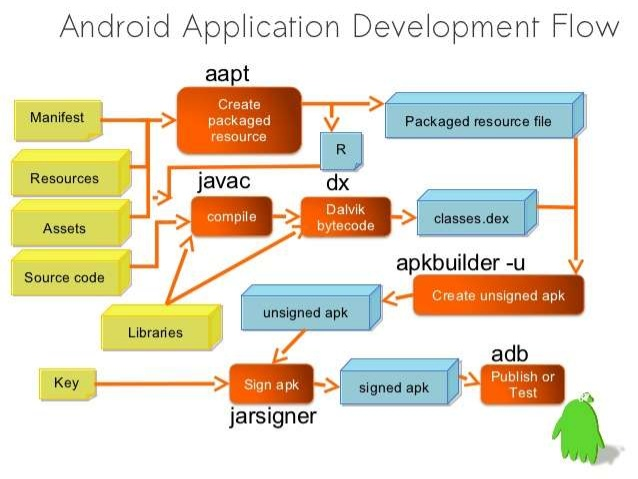

## android 虚拟机
-  [dalvik简介](http://www.slideshare.net/NirajSolanke/google-art-android-run-time)
- [dalvik详细介绍](http://www.slideshare.net/jserv/understanding-the-dalvik-virtual-machine?from_search=4)
- [dalvik vs ART](http://www.slideshare.net/limaniBhavik/artaot-vs-dalvikjit?next_slideshow=1)

## 事件
-  [Touch Event](http://codetheory.in/understanding-android-input-touch-events/)

## 设计模式
- [基本原则](http://www.slideshare.net/AlbertHong5/ss-58896465?from_action=save)
- [23种设计模式](http://zz563143188.iteye.com/blog/1847029)
